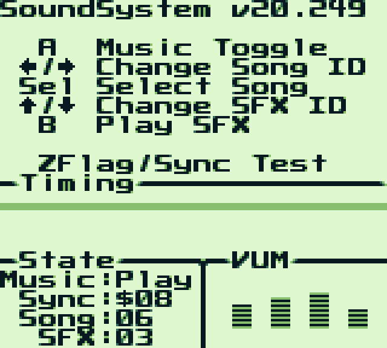

# SoundSystem Audio Driver


## History
The GameBoy Tracker audio system (aka The Paragon5 player) was created in 1999 by [Stephane Hockenhull](https://rv6502.ca/) and used in several commercial GameBoy titles, including Project S-11, Shantae, ESPN National Hockey Night, and Who Wants to Be A Millionaire.

Stephane graciously released the [export-capable tracker and replay routines](https://rv6502.ca/wiki/index.php?title=Game_Boy_Tracker) to the public in July 2014. The assembler files that it exports were compliant with a circa 2014 version of [RGBDS](https://github.com/rednex/rgbds).

RGBDS has since seen many upgrades and improvements that make those tracker-exported assembler files unusable (without modification, see [Integration](https://github.com/BlitterObjectBob/GBSoundSystem#integration) below) with today's RGBDS. The player code itself is showing its age, making it also quite difficult to integrate.

Thus, the **SoundSystem** audio driver was created.

## SoundSystem Introduction
The SoundSystem driver is a modernization of the GameBoy Tracker **replayer** that Stephane wrote. It was rewritten from the ground-up, reusing the core structure and effects routines where possible, and enhanced to make integration into your project very simple. It's perfect for games or demos or whatever else needs audio.

You can put the SoundSystem driver code in any bank you wish, and it includes support for very large ROMs (more than 256 banks). Instead of one large section of a bank for the code, the SoundSystem driver code is composed of many small [sections](https://rednex.github.io/rgbds/rgbasm.5.html#SECTIONS) so it can fit around your more critical code and locations in a bank. It can play both music and sound effects at the same time, and is very fast, even on DMG!

Other peep-hole optimizations were made and it is free of [exceptions](https://bgb.bircd.org/manual.html#features). It is as fast (if not *slightly* faster in some cases) as the original replayer and consumes about the same amount of ROM and WRAM space: 3329 bytes max* of ROM, and 91- bytes max* of WRAM (* depending on the options you assemble with. See [Integration](https://github.com/BlitterObjectBob/GBSoundSystem#integration) below for more details.)


# Materials
Included in this repository is the source code to the driver, and an example ROM with its source code you can use as an integration reference. The example has several songs as well as sound effects and it shows some of the other features like synchronization and VU meters.


# Composing (GameBoy Tracker)
The tracker program is part of Stephane's release materials that you can download from [his wiki page](https://rv6502.ca/wiki/index.php?title=Game_Boy_Tracker). There are download links for various systems and it includes example songs that you can load and change and re-export along with help files. The same song files that are included are the ones that are included in the SoundSystem repository and example ROM.


# Integration
## Song/Instrument Data
As was perviously mentioned, the source files that GameBoy Tracker exports are for an old version of RGBDS, so they will need modification before they can assemble successfully.

For each song (or set of sound effects) that you export, two files will be created: a `.z80` source code file that contains the data, and a `.inc` file that has declarations for exported symbols. You won't need the `.inc` file so you can delete it.

You will need to make some changes in the `.z80` file. First, you need to delete the line that `INCLUDE`s the `.inc` file you discarded. Next, change all `DATA` `SECTION` types to `ROMX`. Finally, if the `.z80` file is for music, find the label for the order table data (this starts with `Music_`) and add a second `:` to make the symbol public. Do the same for the SFX (instrument) table label; this starts with `Inst_`. There is only one label in a sound effects `.z80` file that you need to add a second `:` to; it starts with `SFX_`.

## SoundSystem Source
There are four source files provided in the SoundSystem driver:
- [SoundSystem.asm](Driver/SoundSystem.asm) (required)
- [SoundSystem.def](Driver/SoundSystem.def) (optional if you keep the defaults; required if you want to customize)
- [SoundSystem.inc](Driver/SoundSystem.inc) (required)
- [SoundSystemNotes.inc](Driver/SoundSystemNotes.inc) (optional)

---
### `SoundSystem.asm`
This is the entire source code to the SoundSystem driver. Every routine and code block is contained in its own `SECTION` but which routines that get assembled is determined by the contents of [SoundSystem.def](Driver/SoundSystem.def). For example, if you only need to play music (say, for a demo), you don't have to include the code that plays sound effects. Similarly, if your project doesn't need the VU meters feature, you can disable that code to make the ROM (and WRAM) footprint smaller.

---
### `SoundSystem.def`
This is an `INCLUDE` file that controls the behavior of the SoundSystem driver. By including/excluding certain values described below, you can include/exclude features and control the behavior. These are build-time settings, so you can turn code on and off depending on your specifications.

#### `SOUNDSYSTEM_GBC_COMPATIBLE`
By default, SoundSystem assumes it is part of a DMG-only ROM. If the value at $143 in your ROM is set to DMG/GBC ($80) or GBC ($C0), you should set `SOUNDSYSTEM_GBC_COMPATIBLE` to 1.

**Notes**:
- If `SOUNDSYSTEM_GBC_COMPATIBLE` is 0, SoundSystem will not allow you to specify a WRAM bank other than 0. See `SOUNDSYSTEM_WRAM_BANK` below for more information.
- If `SOUNDSYSTEM_GBC_COMPATIBLE` is 0 or not defined, the value for `SOUNDSYSTEM_WRAM_BANK` will be ignored.
- Neither CPU, code size, nor RAM usage is affected by this setting.

#### `SOUNDSYSTEM_LARGE_ROM`
By default, SoundSystem assumes it is part of a 'small' ROM. That is, 4MBytes (256 banks) or smaller. If the value at $148 is set to CART_ROM_8192K ($08), you should set `SOUNDSYSTEM_LARGE_ROM` to 1 to allow you to place your code and/or audio data into banks >=256.

**Notes**:
- If `SOUNDSYSTEM_LARGE_ROM` is 0, SoundSystem will not allow you to specify a CODE bank other than 0. See `SOUNDSYSTEM_CODE_BANK` below for more information.
- If `SOUNDSYSTEM_LARGE_ROM` is 0 or not defined, the value for `SOUNDSYSTEM_CODE_BANK` must be <256.
- CPU, code size, and RAM usage is slightly more if this is enabled.

#### `SOUNDSYSTEM_CODE_BANK`
By default, SoundSystem will place its code and data in ROM bank 0. If you want to place it in a different bank, set `SOUNDSYSTEM_CODE_BANK` to the bank id.

**Notes**:
- The value you specify in `SOUNDSYSTEM_CODE_BANK` must be legal when all other definitions you have specified in this file are taken into consideration.
- It is up to you to change ROM banks before and after making any SoundSystem call. SoundSystem will not do this for you.
- If `SOUNDSYSTEM_CODE_BANK` is not defined, the code will reside in bank 0.
- Neither CPU, code size, nor RAM usage is affected by this setting.

#### `SOUNDSYSTEM_WRAM_BANK`
By default, SoundSystem will place its WRAM variables in WRAM bank 0. If you want to place it in a different bank, set `SOUNDSYSTEM_WRAM_BANK` to the bank id.

**Notes**:
- The value you specify in `SOUNDSYSTEM_WRAM_BANK` must be legal when all other definitions you have specified in this file are taken into consideration.
- You do not need to change WRAM banks before making any SoundSystem call, however, it is up to you to change WRAM banks after making any SoundSystem call. SoundSystem will not do this for you.
- If `SOUNDSYSTEM_WRAM_BANK` is not defined, the variables will reside in bank 0.
- CPU and code size is slightly less if `SOUNDSYSTEM_WRAM_BANK` is 0.

#### `SOUNDSYSTEM_ENABLE_SFX`
By default, SoundSystem assumes it is part of a game (instead of a demo or some other music-only project.) Therefore, sound effects are enabled by default. If you only need to play music, setting `SOUNDSYSTEM_ENABLE_SFX` to 0 will remove that code and not try to process any sound effects.

**Notes**:
- If `SOUNDSYSTEM_ENABLE_SFX` set to 0, all SFX_ features (see SoundSystem.inc) will not be available.
- If `SOUNDSYSTEM_ENABLE_SFX` is not defined, sound effects will get processed.
- CPU and code size is slightly less when this is disabled.

#### `SOUNDSYSTEM_ENABLE_VUM`
SoundSystem can provide data that can drive a VU-meter type display. This is disabled by default, but access to that data is provided by setting `SOUNDSYSTEM_ENABLE_VUM` to 1.

If enabled, the data (value $0-$F) is in 4 1-byte variables, one per channel:
- 'wVUMeter1' = channel 1
- 'wVUMeter2' = channel 2
- 'wVUMeter3' = channel 3
- 'wVUMeter4' = channel 4

They are contiguous in memory so you can access them as an array if needed.

**Notes**:
- If `SOUNDSYSTEM_ENABLE_VUM` set to 0 or not defined, the 'wVUMeterN' variables will not be available.
- CPU, code size, and RAM usage is slightly more if this is enabled.

---
### `SoundSystem.inc`
This is essentially documentation on the routines included in the driver and any supporting `EQU`ates. (The text from [The API](https://github.com/BlitterObjectBob/GBSoundSystem#the-api) section below came from this file.)

---
### `SoundSystemNotes.inc`
This is an optional `INCLUDE` file provided as a convenience. It contains `EQU`ates for note values that you can pass into `SFX_Play`. *You do not need to include this file in your project if you don't need it.*


# The API
As an optimization, the routines in the SoundSystem driver do not preserve the registers it uses. It is up to you to preserve any register(s) you want to keep before any call to SoundSystem. Any/all registers that each routine uses is listed below in the routine descriptions.

Also, depending on how you have your `SoundSystem.def` set up, it's likely that the ROM and/or WRAM bank will change after each SoundSystem call. It is up to you to restore or change banks as appropriate.

## Main Driver Functions

### `SoundSystem_Init`
This prepares SoundSystem for use. It must be called before any other SoundSystem functions can be called.

**Arguments**: None

**Example**:
```
    call SoundSystem_Init
```

---
### `SoundSystem_Process`
This is the 'heartbeat' of the driver so it should be called every frame. The exact time (in a VBlank or during a frame) isn't important; provided it is called at a regular interval.

CPU usage is dependent on the audio SoundSystem is processing. Each effect has a cost and so the CPU time is not fixed.

**Notes**:
- Registers will not be preserved.
- ROM/WRAM banks could change (based on [SoundSystem.def](Driver/SoundSystem.def) settings).

**Arguments**: None

**Example**:
```
    ; preserve any registers, if applicable
    call SoundSystem_Process
    ; switch ROM bank, if applicable
    ; switch WRAM bank, if applicable
```

## Song (Music) Features

### `Music_PrepareInst`
In order for music to be playable with `Music_Play` (see below), it needs to be 'prepared' first. This routine tells SoundSystem where the instrument table resides, which can be in a different location where the actual music order table (pattern data) resides.

**Notes**:
- This needs to be called before every call to `Music_Play`.
- The instrument table is part of the data that is exported by GB Tracker. Labeled as 'SFX Table' at the end of the exported data.

**Arguments**:
- BC - bank id where the instrument table resides
- DE - pointer to the instrument table

**Example**:
```
    ld   bc,BANK(Inst_s11space)
    ld   de,Inst_s11space
    call Music_PrepareInst
```

---
### `Music_Play`
This is the trigger to start music actually playing (and processed by `SoundSystem_Process`). The order table data can reside in a different location to the instrument data. SoundSystem will handle bank swapping as and when it needs to.

**Notes**:
- `Music_PrepareInst` needs to be called before this.
- The music table is part of the data that is exported by GB Tracker. Labeled as 'Order Table' before the SFX data in the exported data.

**Arguments**:
- BC - bank id where the order table resides
- DE - pointer to the order table

**Example**:
```
    ld   bc,BANK(Music_s11space)
    ld   de,Music_s11space
    call Music_Play
```

---
### `Music_Pause`
This pauses music playback. After the music is paused, it is safe to call `SoundSystem_Process` and sound effects can still be triggered. Call `Music_Resume` (see below) to continue the music playback.

**Notes**:
- Subsequent calls to `Music_Pause` have no effect.
- Calling `Music_Pause` before `Music_Play` has no effect, but best practice is to only call `Music_Pause` after `Music_Play`.

**Arguments**: None

**Example**:
```
    call Music_Pause
```

---
### `Music_Resume`
This resumes music playback after `Music_Pause` (see above) has called.

**Notes**:
- Subsequent calls to `Music_Resume` have no effect, but best practice is to only call `Music_Resume` after `Music_Pause`.

**Arguments**: None

**Example**:
```
    call Music_Resume
```

## Sound Effect (SFX) Features

### `SFX_Prepare`
In order for one-shot sound effects (SFX) to be playable with `SFX_Play` (see below), they need to be 'prepared' first. This routine tells SoundSystem where the sound effects table resides, which can be in a different location where the music data resides.

**Notes**:
- This needs to be called just once per 'set' of sound effects. Once called, any number of `SFX_Play` calls can be made.
- Typically, sound effects are kept separate to any music data.
- Even though they might be labeled the same way in the exported data, one-shot sound effects are different that the sounds in music data.

**Arguments**:
- BC - bank id where the sfx table resides
- DE - pointer to the sfx table

**Example**:
```
    ld   bc,BANK(SFX_Table)
    ld   de,SFX_Table
    call SFX_Prepare
```

---
### `SFX_Play`
This is the trigger to start a one-shot sound effect actually playing (and processed by `SoundSystem_Process`).

**Notes**:
- SFX_Prepare needs to be called before this.
- The sfx table is part of the data that is exported by GB Tracker. Labeled as 'SFX Table' in the exported data.
- The note will only take affect if the sound doesn't set a note in its start command.

**Arguments**:
- B - id (not byte offset) of the sound effect to play
- C - note (frequency) at which to play the sound effect, 0-71; 6 octaves of 12 notes: C_2 (0) to B_7 (71), middle C is C_4 (24). See [SoundSystemNotes.inc](Driver/SoundSystemNotes.inc) for specific values.

**Example**:
```
    ld   b,COOL_SFX_1
    ld   c,C_4
   ;ld   bc,(COOL_SFX_1<<8)|C_4    ; or this way as an optimization
    call SFX_Play
```

---
### `SFX_Stop`
This immediately terminates all one-shot sound effects from playing.

**Notes**:
- It is safe to call this multiple times or of SFX_Play hasn't been called.

**Arguments**: None

**Example**:
```
    call SFX_Stop
```

---
### `SFX_LockChannel3`/`SFX_UnlockChannel3`
This pair of routines affect the wave channel (channel 3) of the GameBoy. Locking the channel will prevent music and other sound effects from using that channel until it is unlocked again.

**Notes**:
- Subsequent calls to either SFX_LockChannel3 or SFX_UnlockChannel3 have no effect. Only the first call changes behavior.
- Channel 3 is unlocked by default.

**Arguments**: None

**Example**:
```
    call SFX_LockChannel3
    ...
    call SFX_UnlockChannel3
```

## Miscellaneous Features

### Playback State
You can check the playback state by inspecting `wMusicPlayState`. `EQU`ates are provided for possible values: either stopped or playing.
```
MUSIC_STATE_STOPPED EQU 0
MUSIC_STATE_PLAYING EQU 1
```

### Synchronization
The tracker has a mechanism that provides a way to synchronize the code with the music via the `Zxx` Flag Command. This sends a value ($00-$FF) to the code to be processed however applicable (or ignored).

`wMusicSyncData`

**Notes**:
- This is a raw value and not further processed by SoundSystem so it is entirely managed the musician.


### VU Meters
SoundSystem can provide data that can drive a VU-meter type display. This is disabled by default, but access to that data is provided by setting `SOUNDSYSTEM_ENABLE_VUM` in [SoundSystem.def](Driver/SoundSystem.def) to 1.

If enabled, the data (value $0-$F) is in 4 1-byte variables, one per channel:
- `wVUMeter1` = channel 1
- `wVUMeter2` = channel 2
- `wVUMeter3` = channel 3
- `wVUMeter4` = channel 4

They are contiguous in memory so you can access them as an array if needed.

**Notes**:
- CPU, code size, and RAM usage is slightly more if this is enabled.

### Identity
There are two symbols that can be used for attribution: `SoundSystem_Version` and `SoundSystem_Author`.

**Notes**:
- These are NULL-terminated strings.

---
# Important Notes

This repository was created and is maintained by GBSS maintainers with Stephane's approval. As such, if you have questions or comments about **SoundSystem**, you can create an issue here in the repository (feel free to create a PR if you're so inclined) and direct them to me.

Any questions specifically about GameBoy Tracker (including the materials found there) or licensing questions, you must direct them to Stephane.

SoundSystem is a Derivative Work (which is why you will see Stephane's name in your ROM, not mine) that is released under the MIT License (see [LICENSE](LICENSE) for more details) but questions regarding licensing for commercial projects need to be directed to Stephane.
